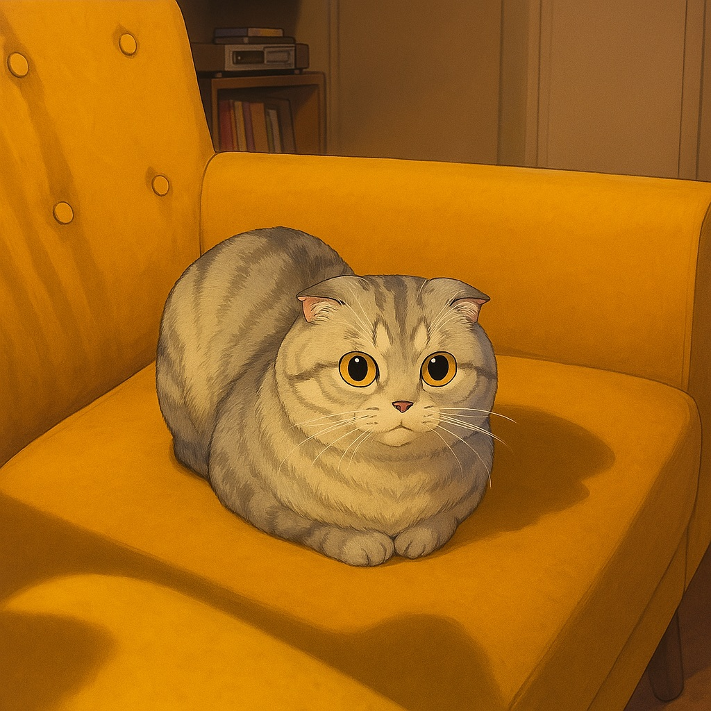

<p align="center">
  
</p>

# Cat-Only Photobooth

> A sleek, minimalist web photobooth that only lets you capture photos when a **cat is in frame**.  
> Real-time computer vision, premium UI styling — built for fun and for portfolio practice.

---

## ✨ Features
- Real-time **cat detection** powered by TensorFlow.js (COCO-SSD).
- Green overlay for cats, red overlay for everything else.
- **Capture button** enabled only when a cat is present.
- Captured photos displayed in a refined **square gallery**.
- Download or clear shots with one click.
- Premium, minimalist design (neutral palette, subtle icons).

---

## 🚀 Getting Started

1. **Clone the repo**
   ```bash
   git clone https://github.com/your-username/cat-only-photobooth.git
   cd cat-only-photobooth
   ```

2. **Install dependencies**
   ```bash
   npm install
   ```

3. **Run locally**
   ```bash
   npm run dev
   ```

4. **Open in your browser**
   ```
   http://localhost:5173
   ```

---

## 📷 Demo


---
